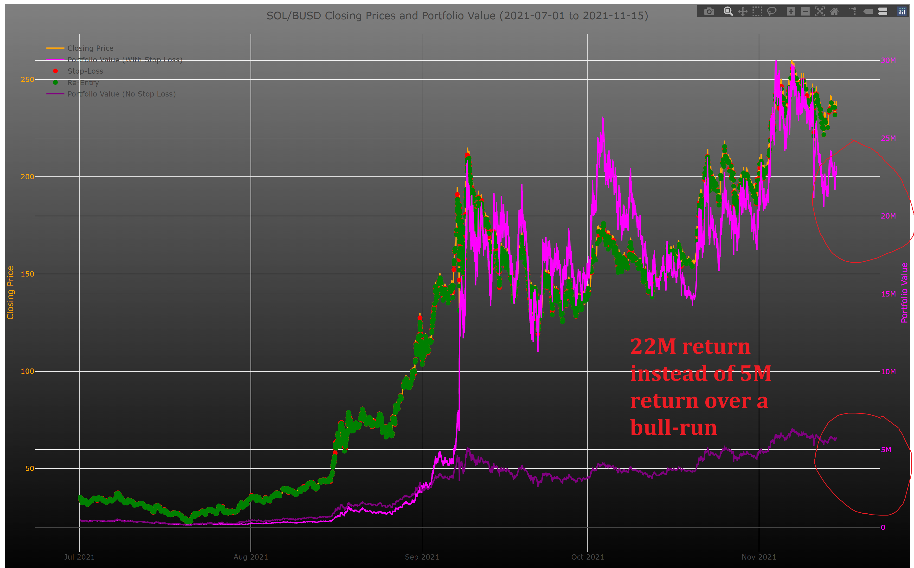

# Crypto Trader V 3.0

## Please use the shell scripts available in the root folder to start, stop, and diagnose the server

 
Before running the server you sould create the

binance-api.json 

file in the dist folder. In the private folder there are examples
The API-Keys are mandatory and can be obtained on the crypto exchange

[.json Config File](docs/json-config.md)

[Billionaire coins](docs/billionaire.md)

[This year starters](docs/this%20year%20good%20starters.md)

[Keeping system time sharp](docs/chrony.md)

[CSV Backtracking Data Downlaod](docs/CSV-DATA.md)

[Google Cloud Installation Instructions](docs/GOOGLE-CLOUD.md)

# PURPOSE

This Script uses an advanced Plotting Library that uses the GPU for faster processing to process millions of exact data from Crypto Currency that can be as fine as minute-exact data over the course of many years

Normal libraries like chart.js fail to compute this in reasonable time and offer only a blank screen

This script can simulate the following strategy

=> Exit at a stop-loss
=> Re-entry at a local maximum or minimum

do this millions of times

This increases the returns of a crypto investment by around 1 order of magnitude !!!

# Private Keygen for gh

ssh-keygen -t ed25519 -C "1deep.coin1@gmail.com"

gh auth login
